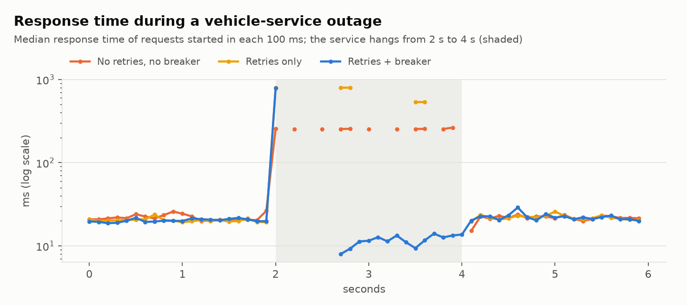

# Chaos experiment

Generated by `pgw chaos`. Everything runs in one process (real gRPC over mTLS, real gateway), with 20 concurrent partner clients reading vehicle state. Client deadline per call: 250 ms. Each row is the median of 3 runs.

## Flaky: 30% of vehicle-service calls fail

| Gateway | Success | p50 | p95 | Calls to vehicle service per request |
|---|---:|---:|---:|---:|
| No retries, no breaker | 71.1% | 21.7 ms | 33.9 ms | 1.00 |
| Retries only | 97.5% | 18.9 ms | 77.1 ms | 1.37 |
| Retries + circuit breaker | 97.6% | 19.7 ms | 77.6 ms | 1.38 |

## Outage: the vehicle service hangs for 2 s, then recovers

Clients send their next request as soon as the previous one returns, so slow failures mean fewer requests. The comparison uses the outage window itself.

| Gateway | Partner requests while down | Median response while down | Calls sent to the hung service | Success in the 2 s after recovery |
|---|---:|---:|---:|---:|
| No retries, no breaker | 140 | 254.9 ms | 160 | 100.0% |
| Retries only | 40 | 674.0 ms | 160 | 100.0% |
| Retries + circuit breaker | 727 | 11.6 ms | 75 | 94.7% (94%–96%) |

